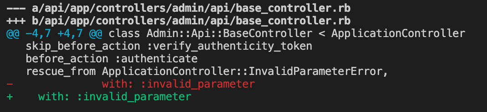
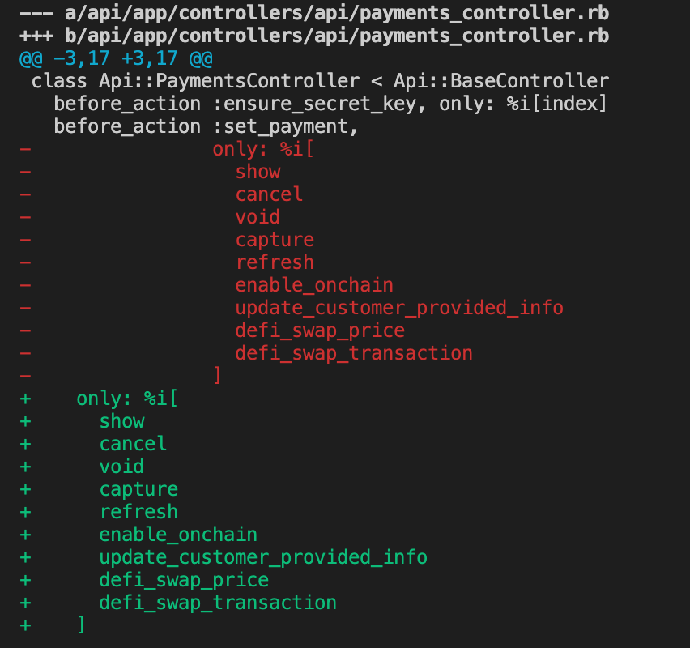
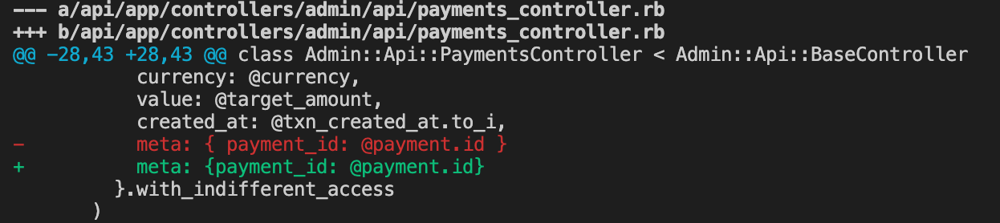
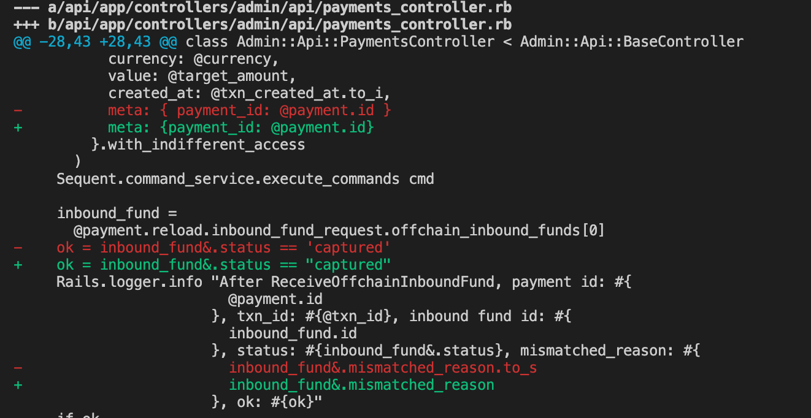
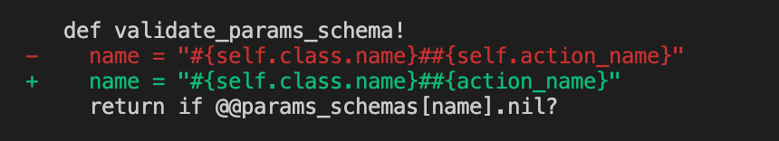
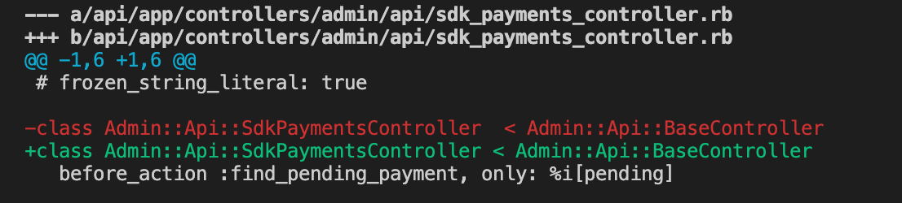
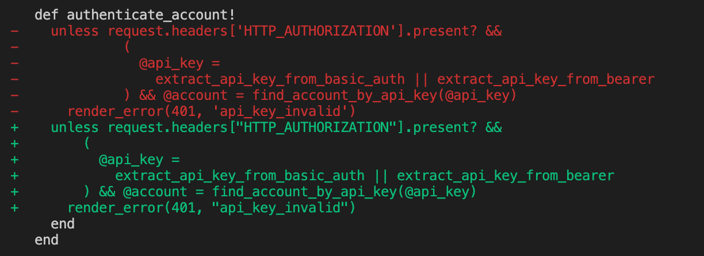
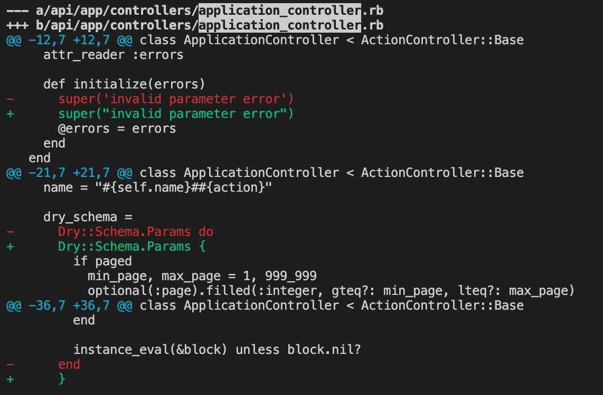
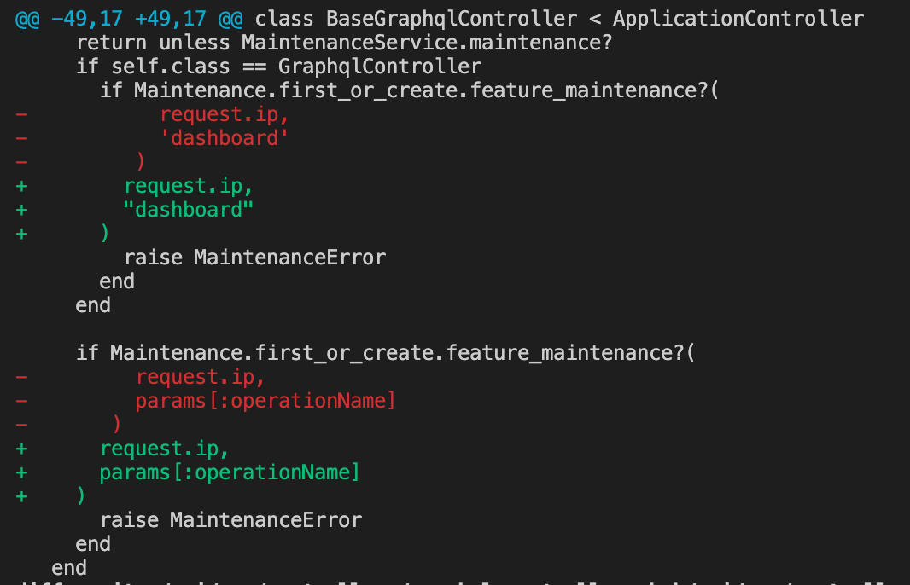
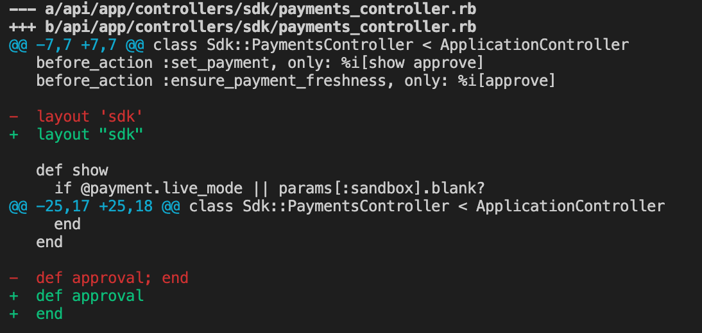

# POC of Ruby Standard

## References

- https://github.com/testdouble/standard

## Usage

```
bundle exec standardrb
bundle exec standardrb "app/controllers/**/*.rb" --fix
```

- with --fix option

It will automatically fix some problems.

```
bundle exec standardrb --fix
```

## Rules

- 2 spaces
- double quotes for string
- hash syntax {hash: syntax}
- single-line block with {}, multiline block with do / end
- leading dot on multi-line method chain [reason](https://github.com/testdouble/standard/issues/75)
- space inside block, but not hash

## Our Cases

- multiline params




- no space inside hash



- modify code

remove to_s inside Rails.logger.info



remove self



- adjust space numbers



- multiline conditions



[what to do when if conditions too long](https://github.com/rubocop/ruby-style-guide/issues/476)

always puts the condition on the same line. If the conditions is too long, there are two ways to resolve it.

1. if..then..end
2. use variable to save the value of conditions

- block do / end

I have a concern in it. Most time we use {} in one-line block, use do / end in multiline block.



- if condition

method in if condition



- empty method



