# POC of Ruby Standard

- https://github.com/testdouble/standard

## Usage

```bash
bundle exec standardrb

# the --fix option wil fix the code automatically
bundle exec standardrb --fix

# you can choose which files you want to fix
bundle exec standardrb "app/controllers/**/*.rb" --fix
```

## Rules

- 2 spaces
- double quotes for string
- hash syntax {hash: syntax}
- single-line block with {}, multiline block with do / end
- leading dot on multi-line method chain [reason](https://github.com/testdouble/standard/issues/75)
- space inside block, but not hash

## multiline params


## no space inside hash


## remove to_s


## remove self


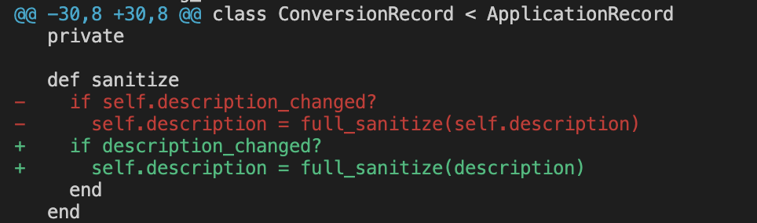

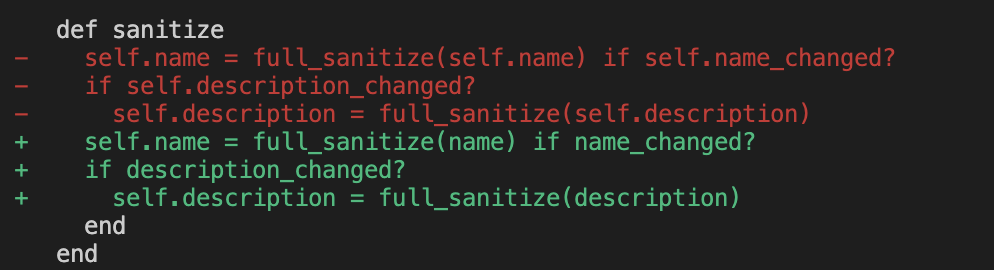

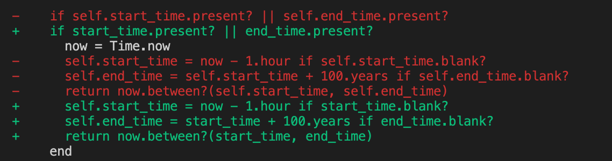

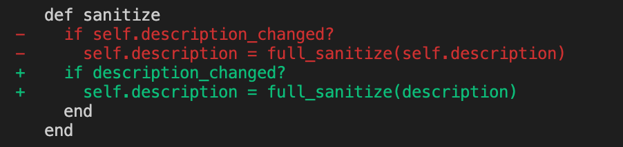

## multiline conditions


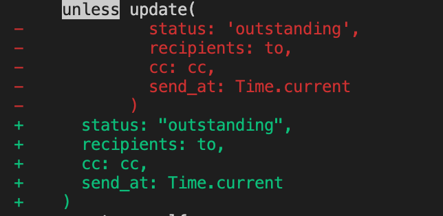

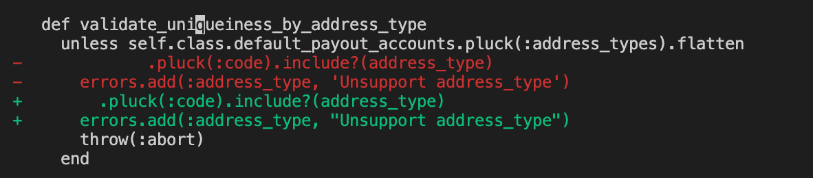

[what to do when if conditions too long](https://github.com/rubocop/ruby-style-guide/issues/476)

always puts the condition on the same line. If the conditions is too long, there are two ways to resolve it.

1. if..then..end
2. use variable to save the value of conditions

## do end vs {}

I have a concern in it. Most time we use {} in one-line block, use do / end in multiline block.


## empty method


## no more space in model validation

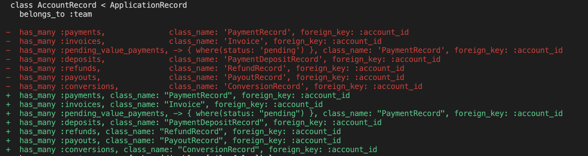

## ident in model scope

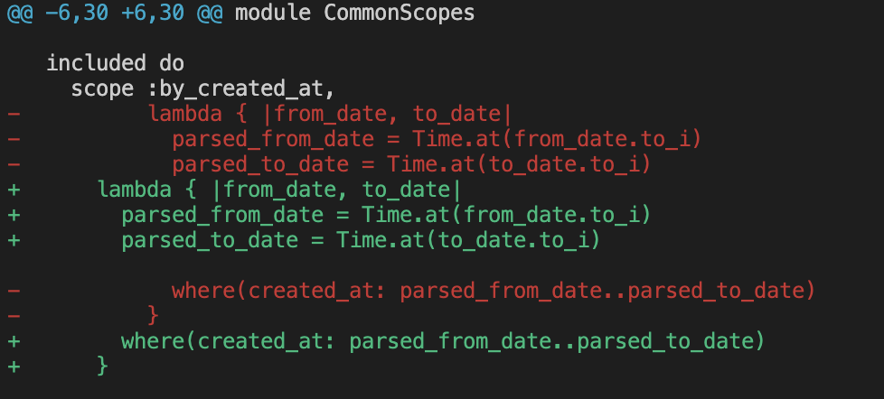

## indent in model belongs_to

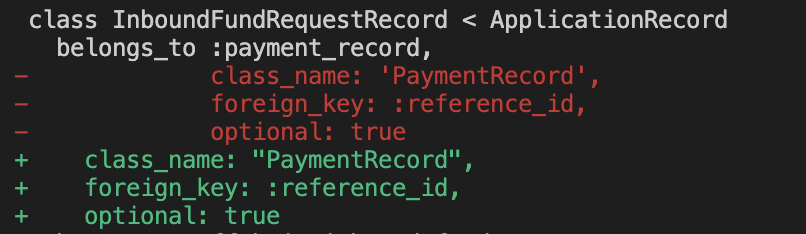

## modify code in hash merge

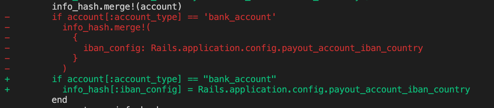

## self modify

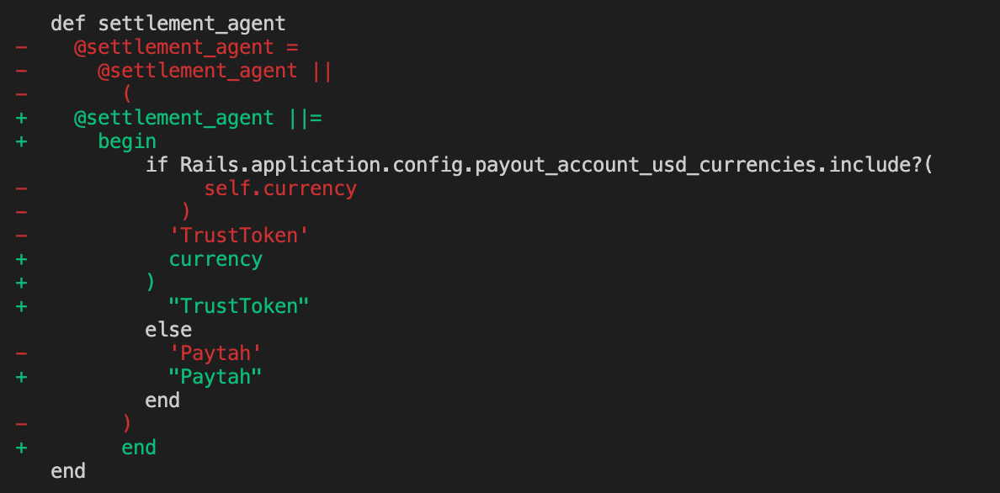

## Conclusion

- a lot of change about single-quotes to double-quotes
- a lot of change about no space inside hash
- changes about do...end or {}
- ident changes in multi-line conditions
- ident changes in multi-line method call
- remove to_s inside "#{}"
- remove self in some cases
